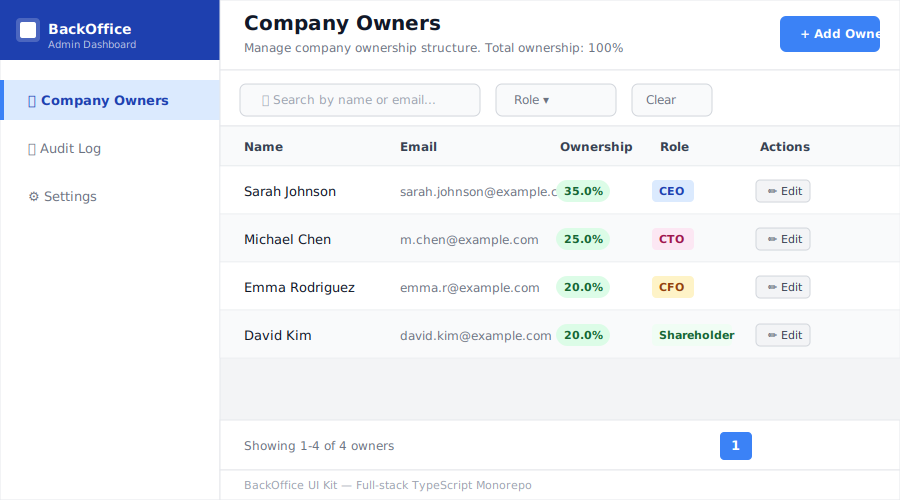
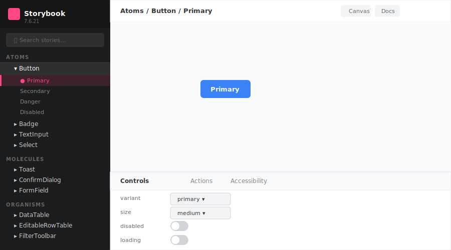

# BackOffice UI Kit

[](https://www.typescriptlang.org/)
[](https://nextjs.org/)
[](https://nestjs.com/)
[](https://reactjs.org/)
[](https://storybook.js.org/)
[](https://pnpm.io/)
[](https://aws.amazon.com/cdk/)
[](LICENSE)

Portfolio-grade, business-ready BackOffice UI Kit monorepo built with React, TypeScript, Next.js, and NestJS.

> 🚀 **Live Demo:** [Storybook Component Library](http://localhost:6006) | [Demo Application](http://localhost:3002)

## 📋 Table of Contents

- [Screenshots](#-screenshots)
- [Why This Project?](#-why-this-project)
- [Project Structure](#project-structure)
- [Tech Stack](#tech-stack)
- [Getting Started](#getting-started)
- [Packages](#packages)
- [Features](#features)
- [Quick Start](#quick-start)
- [Deployment](#deployment-to-aws)
- [Documentation](#documentation)
- [License](#license)

## 🎯 Why This Project?

This project showcases professional-level skills in:

- **Modern Architecture**: Monorepo setup with multiple interconnected packages
- **Design Systems**: Building reusable component libraries with Atomic Design
- **Full-Stack Development**: Seamless integration between frontend and backend
- **TypeScript Excellence**: Shared types ensure type safety across the entire stack
- **Developer Experience**: Storybook for rapid component development and documentation
- **Production Ready**: AWS infrastructure with Docker, CI/CD, and best practices
- **Code Quality**: Strict TypeScript, validation, WCAG accessibility standards

Perfect for demonstrating expertise to potential employers or as a foundation for real-world projects.

## 📸 Screenshots

### Demo Application — Owners Management



### Component Library — Storybook



---

## Project Structure

```text
backoffice-kit/
├── apps/
│   ├── web/          # Next.js demo app (App Router)
│   └── api/          # NestJS API with CRUD endpoints
├── packages/
│   ├── ui/           # React component library with Storybook
│   └── shared/       # Shared TypeScript types and DTOs
├── pnpm-workspace.yaml
└── package.json
```

## Tech Stack

- **Monorepo**: pnpm workspaces
- **UI Library**: React + TypeScript, Storybook
- **Demo App**: Next.js (App Router), TypeScript
- **API**: NestJS, TypeScript
- **Shared Types**: Pure TypeScript package

## Getting Started

### Prerequisites

- Node.js >= 18.0.0
- pnpm >= 8.0.0

### Installation

```bash
# Install dependencies
pnpm install

# Build all packages
pnpm build
```

### Development

```bash
# Run Storybook for UI development
cd packages/ui
pnpm storybook

# Run NestJS API
cd apps/api
pnpm dev

# Run Next.js demo app
cd apps/web
pnpm dev

# Build shared types
cd packages/shared
pnpm build
```

## Packages

### @backoffice-kit/shared

Shared TypeScript types and DTOs used across frontend and backend:

- Owner types (Owner, OwnerCreateDto, OwnerUpdateDto, OwnerRole)
- Audit log types (AuditLogItem, AuditAction, AuditFilterParams)
- Common types (PaginationResponse, PaginationParams)
- Validation types (ValidationErrorShape with helpers)

### @backoffice-kit/ui

React component library following Atomic Design principles:

- **Atoms**: Badge, Button, Card, Select, Spinner, TextInput
- **Molecules**: ConfirmDialog, EmptyState, FormField, SearchField, Toast
- **Organisms**: DataTable, EditableRowTable, FilterToolbar, PaginationBar, SaveBar
- **Templates**: Coming soon

View components in Storybook at [http://localhost:6006](http://localhost:6006)

### @backoffice-kit/web

Next.js demo application showcasing the UI library:

- **App Router** with TypeScript
- **Pages**: /owners (connected to API), /audit (placeholder), /settings (placeholder)
- **Layout**: Sidebar navigation consuming UI components
- **API Integration**: Full CRUD operations with the NestJS backend
- **Integration**: Uses workspace packages (@backoffice-kit/ui, @backoffice-kit/shared)

View the app at [http://localhost:3000](http://localhost:3000)

### @backoffice-kit/api

NestJS REST API with TypeScript:

- **CRUD Endpoints**: GET, POST, PUT, DELETE for /owners
- **Validation**: class-validator with DTO validation
- **Pagination**: Server-side pagination and search
- **CORS**: Enabled for Next.js app
- **In-memory Store**: Simple array-based storage with seed data (4 owners)
- **Shared Types**: Uses @backoffice-kit/shared for type consistency

API runs at [http://localhost:3001](http://localhost:3001)

## Current Status

✅ **M1 Complete**: Monorepo setup + shared package
✅ **M2 Complete**: UI package setup + Storybook + Button component
✅ **M3 Complete**: Next.js app + layout + /owners page shell
✅ **M4 Complete**: NestJS API + CRUD endpoints + connected to Next.js + Add/Edit owners working
✅ **M5 Complete**: More atoms (TextInput, Select, Badge, Spinner, Card) + Storybook stories
✅ **M6 Complete**: Molecules (FormField, SearchField, ConfirmDialog, Toast, EmptyState) + Storybook stories
✅ **M7 Complete**: Organisms (DataTable, EditableRowTable, FilterToolbar, PaginationBar, SaveBar) + Storybook stories
✅ **M8 Complete**: Complete demo pages (/owners with EditableRowTable + filters + pagination, /audit with DataTable + sorting + filtering, /settings with FormFields + SaveBar)
✅ **M9 Complete**: AWS deployment configuration (CDK infrastructure, Docker, CI/CD, documentation)

## Features

- 🎨 **Atomic Design** architecture (atoms → molecules → organisms → templates)
- ♿ **WCAG 2.1 AA** accessibility patterns
- 📚 **Storybook** documentation with 40+ stories
- 🔒 **TypeScript** strict mode across all packages
- 🎯 **Separation of concerns** (UI library vs business logic)
- 🧪 **Story-based** component testing
- 🎪 **Live component** playground
- 🚀 **AWS deployment** ready (ECS Fargate, RDS, S3/CloudFront)
- 🔄 **CI/CD pipeline** with GitHub Actions
- 📦 **Monorepo** with pnpm workspaces
- 🐳 **Docker** containerization for API
- 🏗️ **Infrastructure as Code** with AWS CDK

## Quick Start

### Development

```bash
# Clone the repository
git clone https://github.com/Binyame/backoffice-ui-kit.git
cd backoffice-ui-kit

# Install dependencies
pnpm install

# Build all packages
pnpm build

# Run development servers
pnpm dev              # Runs all services (API on :3001, Web on :3000)

# Or run individually
cd apps/api && pnpm dev      # API only
cd apps/web && pnpm dev      # Web only
cd packages/ui && pnpm storybook  # Storybook only
```

### Deployment to AWS

```bash
# Quick deploy (automated script)
./scripts/deploy.sh dev      # Deploy to development
./scripts/deploy.sh prod     # Deploy to production

# Or deploy manually with CDK
cd infrastructure
pnpm install
npx cdk deploy --all -c environment=dev
```

See **[DEPLOYMENT.md](DEPLOYMENT.md)** for detailed deployment instructions.

## Scripts

```bash
# Development
pnpm dev              # Run all packages in dev mode

# Building
pnpm build            # Build all packages

# Linting
pnpm lint             # Lint all packages

# Clean
pnpm clean            # Clean all build artifacts
```

## Documentation

- **[DEPLOYMENT.md](DEPLOYMENT.md)** - Complete AWS deployment guide
- **[ARCHITECTURE.md](ARCHITECTURE.md)** - System architecture and technical details
- **[Storybook](http://localhost:6006)** - Live component documentation (run `pnpm storybook`)

## Project Highlights

This project demonstrates:

- ✅ **Full-stack TypeScript** monorepo with pnpm workspaces
- ✅ **16 production-ready components** (6 atoms, 5 molecules, 5 organisms)
- ✅ **40+ Storybook stories** with comprehensive documentation
- ✅ **3 fully functional pages** with real-time CRUD operations
- ✅ **WCAG 2.1 AA accessibility** throughout
- ✅ **AWS infrastructure** (ECS, RDS, S3, CloudFront)
- ✅ **CI/CD pipeline** with automated deployments
- ✅ **Docker containerization** for the API
- ✅ **Infrastructure as Code** using AWS CDK
- ✅ **PostgreSQL database** with TypeORM
- ✅ **100% TypeScript** with strict mode

## Tech Stack

**Frontend:**
- Next.js 14 (App Router)
- React 18
- TypeScript 5
- CSS Modules
- Custom UI Library (@backoffice-kit/ui)

**Backend:**
- NestJS 10
- PostgreSQL (RDS)
- TypeORM
- class-validator
- Docker

**Infrastructure:**
- AWS ECS Fargate
- AWS RDS PostgreSQL
- AWS S3 + CloudFront
- AWS CDK (TypeScript)
- GitHub Actions

**Development:**
- pnpm workspaces
- Storybook 7
- ESLint
- Prettier

## License

MIT
